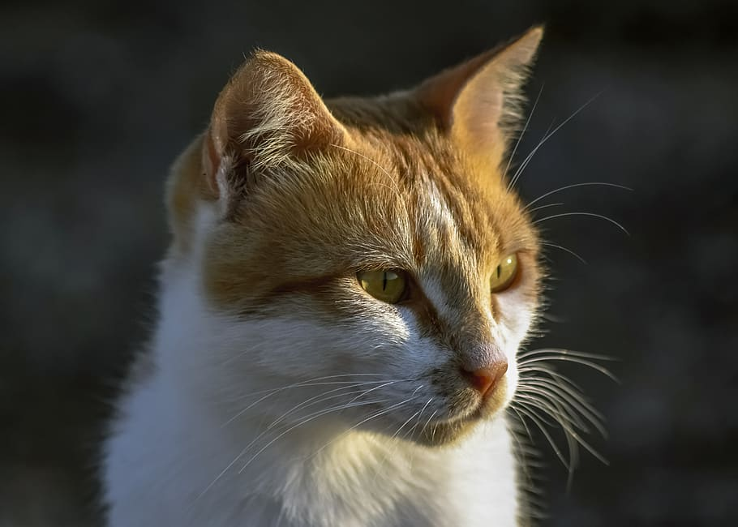

# Picture to ASCII converter
Turns a picture into text using its brightness.  

#### Python version
Run script: `python draw_image.py path/to/img`

#### C++ version
Compile (Linux, using CImg lib): `g++ -o drawImage draw_image.cpp -lm -lpthread -lX11`  
Execute: `./drawImage path/to/img`

Photo
---

ASCII
---

