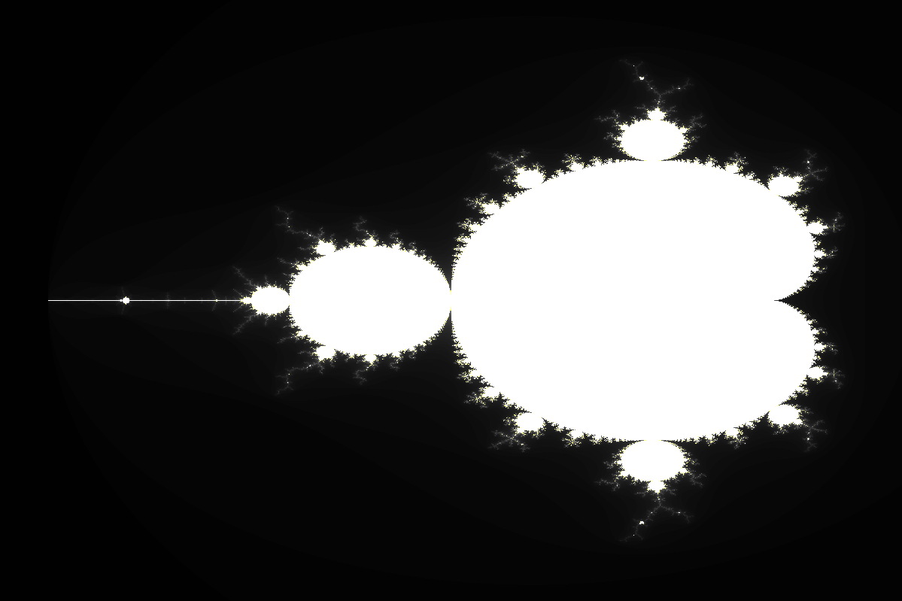
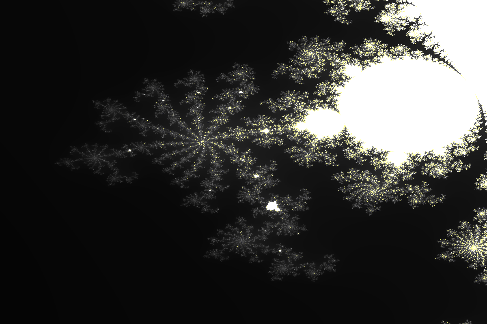

# Mandelbrot set visualization
This folder contains two different Mandelbrot set visualizations:
- **MandelbrotImage** opens a window with a visualization of the Mandelbrot set
- **MandelbrotASCII** visualizes the Mandelbrot set using ASCII characters in the terminal

Both versions support interactive control over the position, zoom, maximum interations and divergence threshold. Computations are parallelized using the OpenMP framework. MandelbrotImage uses SDL2 to open a window and display the Mandelbrot set.

